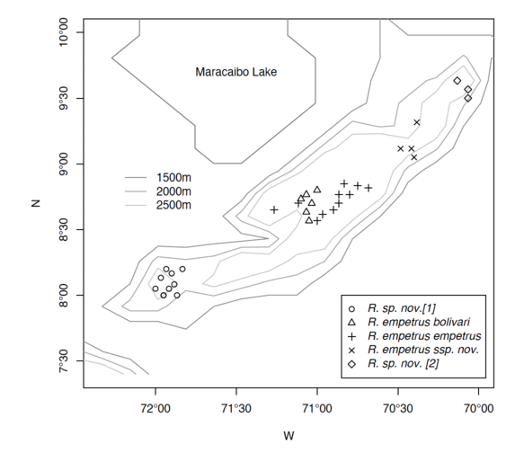

layout: true

<div class="my-footer"><span>JR Ferrer-Paris / <a href='https://github.com/UNSW-codeRs/geospatial-data-in-R'>geospatial-data-in-R</a></span></div>

<!-- this adds the link footer to all slides, depends on my-footer class in css-->

```{r xaringan-logo, echo=FALSE}
xaringanExtra::use_logo(
  image_url = "https://unsw-coders.netlify.app/home/welcome_files/logo.png",
  position = xaringanExtra::css_position(top = "1em", right = "1em")
)
```

---

class: center,inverse
background-image: url("images/Heal-Country-NAIDOC-2021.png")
background-position: center
background-size: contain

---

class: inverse, center, middle


```{r setup, include=FALSE}
options(htmltools.dir.version = FALSE)
library(tmap)
require(sp)
library(sf)
require(rgdal)
require(raster)
require(plotrix)
require(dplyr)
require(magrittr)
require(RColorBrewer)
require(ggplot2)
require(leaflet)
library(fontawesome)
```

# Spatial or geospatial?

---


# Spatial data 

Basically, spatial data is not much more than ordinary data (vectors or matrices) with spatial properties. 

These are commonly summarised as coordinates representing their location in space (usually 2D or 3D).

$$ \mathrm{spatial} \ \mathrm{data} = \mathrm{data} + \mathrm{coordinates} $$
--

That does not look so hard, right?




---

# Geospatial data

Geospatial data is a special type of spatial data that uses a Coordinate Reference System (CRS)

$$ \mathrm{geospatial} \ \mathrm{data} = \mathrm{data} + \mathrm{coords} + \mathrm{CRS} $$

Using explicit and standard CRS allows to:

- Translate locations on the earth to planar coordinates.
- Compare, overlay and combine spatial data using the same CRS
- Transform coordinates between alternative CRS

--

In this workshop we will see examples that:

- focus on the **data** and use **coordinates** as an aesthetic in plots
- modify **CRS** to improve visualisation
- focus on the **coordinates** to perform spatial operations
- use **coordinates** to query **data**
- use **coordinates** to modify the **data**
- models that use both **data** and **coordinates**

---

# Geospatial data types

The two primary types of (geo-)spatial data are raster and vector data. 

**Raster data** is stored as a grid of values which are rendered on a map as pixels or cells. Each pixel value represents an area on the Earth’s surface with. **Vector data** structures represent specific features on the Earth’s surface, and assign attributes to those features.

---

## Rasters 

- Raster data is pixelated data where each pixel is associated with a specific location.
- Raster data always has an extent and a resolution.
- The extent is the geographical area covered by a raster.
- The resolution is the area covered by each pixel of a raster.

Examples of raster data: aerial photographs, satellite images, precipitation maps, elevation maps, landcover maps, etc.

One common file formats for raster data is the [GeoTIFF](https://en.wikipedia.org/wiki/GeoTIFF) format.

A raster file can contain data on multiple variables stored as **bands** (each band represents one variable) that share the same spatial properties (extent, resolution, etc).

---

## Vectors

- Vector data structures represent specific features on the Earth’s surface, and assign attributes to those features.
- Vectors are composed of discrete geometric locations that define the shape of the spatial object (points, lines, polygons).
- A table of attributes links each spatial object (row) with multiple attributes (columns).


Examples of vector data: sampling locations or cities, roads or routes, country boundaries.

There are many file formats for vector data: ESRI Shapefiles are very popular, OGC GeoPackage (GPKG) is an open and standards-based format, GeoJSON is used in many web applications.


---
class: inverse, middle, center


# Examples of spatial operations and analysis

---

## Visualisation

Sometimes coordinates are just additional aesthetics variables in our plots.

--

For example: Consider data about trends in human population size in major cities of the world. 


```{r}
data(metro)
metro
```

---

We use geographic coordinates (latitude and longitude) to locate each city in the map of the world, and for each city we have several estimates of population size for each decade.

```{r}
metro <- metro %>% mutate(growth = (pop2020 - pop2010)/(pop2010 * 10) * 100)
```


For example if we compare the population size in major cities of the world between 2010 and 2020, we can calculate population growth and use the coordinates to show where are the cities with largest growth.

---

### Visualisation

For example if we compare the population size in major cities of the world between 2010 and 2020, we can calculate population growth and use the coordinates to show where are the cities with largest growth.

```{r}

data(World)

my_map <- tm_shape(World, projection='+proj=robin') + 
  tm_polygons() +
  tm_text("iso_a3", size = "AREA", col = "gray30", root = 3) +
  tm_shape(metro) + tm_bubbles("pop2010", col = "growth",
  border.col = "black", border.alpha = 0.5,
  breaks = c(-Inf, 0, 2, 4, 6, Inf), palette = "-RdYlGn",
  title.size = "Metro population (2010)",
  title.col = "Annual growth rate (%)", id = "name",
  popup.vars = c("pop2010", "pop2020", "growth")) 

```

---

```{r}
my_map
```


---

### Spatial operations

Calculating distances between datasets

---

### Spatial queries

Comparing two datasets

---

### Filling gaps: spatial interpolation

For example, a group of biologists are studying if the activity of a frog species in related to vegetation characteristics in a botanical garden. They use a paper map and write down coordinates of each sampling point where they describe characteristics of the vegetation at these points.
For example, our team of biologist collected data about leaf litter in several locations

---

### Filling gaps: spatial interpolation


For example, our team of biologist collected data about leaf litter in several locations


```{r,eval=TRUE,echo=FALSE,message=FALSE}
here::i_am("intro-presentation/Intro.Rmd")

boundary_utm <- read_sf(here::here("data","JBM.gpkg")) %>% 
  filter(id %in% c(7,8,11))
data_utm <- read_sf(here::here("data","JBM-points.gpkg"))

rnull <- raster(extent(boundary_utm),
                nrows=18, ncols=24,
                crs=st_crs(boundary_utm)$proj4string)
mask <- distanceFromPoints(rnull,data_utm)<50

ss <- values(mask)==1

prd.grd <- SpatialPixelsDataFrame(
  points=xyFromCell(mask,1:ncell(mask))[ss,],
  data=data.frame(values(mask)[ss]),
  proj4string=CRS(st_crs(boundary_utm)$proj4string))

```

.pull-left[
If you have a dataset named `pts` with coordinates and  a categorical variable named `Tree.cover`:

```{r,fig.height=4, fig.width=4,dev='svg',message=F,echo=FALSE}

dts <- data_utm #%>% mutate(TCC=factor(`Tree cover`))
st_crs(dts) <- NA


ggplot(dts) + 
  geom_sf(aes(size=`Tree cover`, colour=`Tree cover`)) +
  labs(subtitle="Coordinates in meters", x="x", y="y",
       size="Tree\ncover\nclass", colour="Tree\ncover\nclass") +
  guides(color= guide_legend(), size=guide_legend())


```
]

.pull-right[

```{r, fig.height=4, fig.width=4,dev='svg',message=F}
require(gstat)
v = variogram(I(Tree.cover > 2)~1,data_utm)
vm = fit.variogram(v, vgm(1, "Exp", 70, .1))
plot(v,vm)
```
]

---

# Spatial analysis in **R**

```{r,message=FALSE}
ik = krige(I(Tree.cover > 2)~1, as_Spatial(data_utm), prd.grd, vm)


```
.pull-left[
```{r,fig.height=4,fig.width=4,dev='png',message=FALSE}
spplot(ik["var1.pred"],
       main = "ordinary kriging predictions",
       sub = "Z = Tree Cover > 2")
```
]

.pull-right[
```{r,fig.height=4,fig.width=4,dev='png',message=FALSE}
spplot(ik["var1.var"],
       main = "ordinary kriging variance",
       sub = "Z = Tree Cover > 2")
```
]


---
class: inverse, middle, center

# Let's try some packages with these tutorials

[UNSW codeRs @ GitHub](https://github.com/UNSW-codeRs) / [geospatial-data-in-R](https://github.com/UNSW-codeRs/geospatial-data-in-R)


[Tutorial 1: create a spatial object](https://yessl3-unswcoders.shinyapps.io/tutorial-1-create-spatial-object/)


[Tutorial 2: points, lines and polygons](https://yessl3-unswcoders.shinyapps.io/tutorial-2-points-lines-polygons/)
---


class: center, middle

# Thanks!

.center[## Dr. José R. Ferrer-Paris


[`r fa(name = "github")` @jrfep](http://github.com/jrfep)
/
[`r fa(name = "paper-plane")` j.ferrer@unsw.edu.au](mailto:j.ferrer@unsw.edu.au)

]
