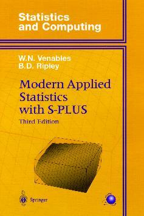
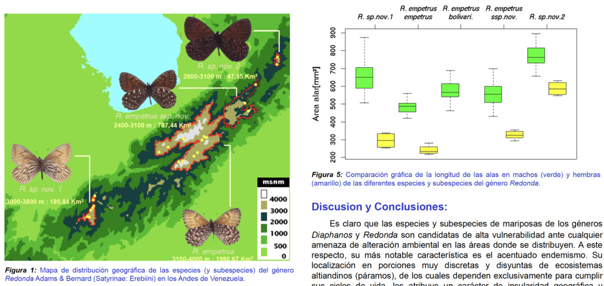
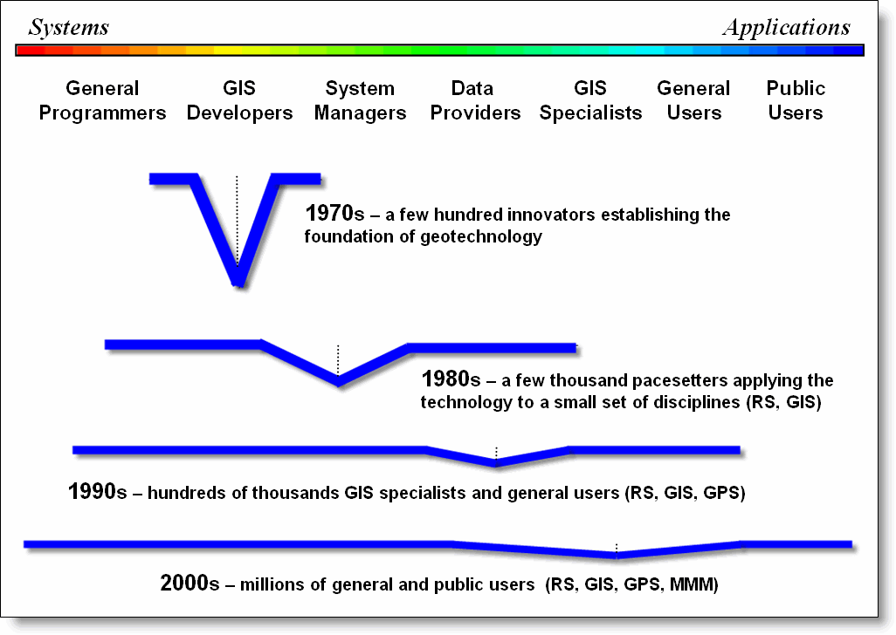

layout: true

<div class="my-footer"><span>JR Ferrer-Paris / <a href='https://github.com/UNSW-codeRs/geospatial-data-in-R'>geospatial-data-in-R</a></span></div>

<!-- this adds the link footer to all slides, depends on my-footer class in css-->

```{r xaringan-logo, echo=FALSE}
xaringanExtra::use_logo(
  image_url = "https://unsw-coders.netlify.app/home/welcome_files/logo.png",
  position = xaringanExtra::css_position(top = "1em", right = "1em")
)
```

---

class: center,inverse
background-image: url("images/Heal-Country-NAIDOC-2021.png")
background-position: center
background-size: contain

---

class: inverse, center, middle


```{r setup, include=FALSE}
options(htmltools.dir.version = FALSE)
require(sp)
require(rgdal)
require(raster)
require(plotrix)
require(dplyr)
require(magrittr)
require(RColorBrewer)
require(ggplot2)
require(leaflet)
library(fontawesome)
```


# It all started with a bold decision

The year 1997: **[Free Software and Open Source!](https://en.wikipedia.org/wiki/History_of_free_and_open-source_software)**


.center[

]

---

# Universität Bayreuth - 1999

.pull-left[

]

--

.pull-right[
I was (almost) ready to begin my thesis

- OS: GNU/Linux from SuSE

- Writing: LaTeX

- Editor: GNU Emacs

- Statistics: ?

]

--

A brief synopsis of [History and Overview of R](https://bookdown.org/rdpeng/rprogdatascience/history-and-overview-of-r.html)

- 1991: R was created by R. Ihaka and R. Gentleman
- 1993: First public announcement of R
- 1995: R adopted the GNU General Public License
- 1996: Public mailing lists created (the R-help and R-devel lists)
- 1997: R Core Group was formed
- 2000: R version 1.0.0 was released to the public.

---

# Universität Bayreuth - 1999

I am ready to learn, if only someone would teach me...

.pull-left[

]

--

.pull-right[


]


---

# My first map in R!

When you have a hammer...
--
every problem is a nail!
--


---
class: inverse, middle, center

# First steps with GIS


---

# Maybe is time to learn more about GIS

Three key aspects of Geographic Information Systems :

--

- Visual exploration of spatial data ("Mapping")

--

- Data structures, projection and spatial queries (Spatial Database)

--

- Analysis and modelling of spatial data

---

# GIS and **R** side by side

Just mapping? use GIS software

Non spatial statistical analysis ? use **R**



---

# Spatial analysis in **R**

```{r,eval=TRUE,echo=FALSE,message=FALSE}
data_ll <- read.csv("../data/JBM-points.csv")
coordinates(data_ll) <- c("Longitude","Latitude")
proj4string(data_ll) <- "+proj=longlat +datum=WGS84"
boundary_ll <- readOGR("../data/JBM.gpkg",verbose = F)
boundary_utm <- spTransform(boundary_ll, CRS("+proj=utm +zone=19n +datum=WGS84"))

data_utm <- spTransform(data_ll, CRS("+proj=utm +zone=19n +datum=WGS84"))

rnull <- raster(extent(boundary_utm[boundary_utm@data$id %in% c(7,8,11),]),
                nrows=18, ncols=24)
mask <- distanceFromPoints(rnull,data_utm)<50
prd.grd <- SpatialPixelsDataFrame(points=xyFromCell(mask,1:ncell(mask))[values(mask)==1,],data=data.frame(values(mask)[values(mask)==1]),
                                  proj4string=boundary_utm@proj4string)

```

.pull-left[
If you have a dataset named `pts` with coordinates and  a categorical variable named `Tree.cover`:

```{r,fig.height=4, fig.width=4,dev='svg',message=F,echo=FALSE}
par(mar=c(0,0,0,0))
plot(data_utm,col=as.numeric(data_utm@data$Tree.cover),cex=as.numeric(data_utm@data$Tree.cover)/2,pch=19)
legend("bottomright",legend=1:4,col=1:4,pch=19,pt.cex=c(1:4)/2,title="Tree cover class",horiz=T,cex=.8)

ss <- !is.na(data_utm@data$Tree.cover)
pts <- data_utm[ss,]

```
]

.pull-right[

```{r, fig.height=4, fig.width=4,dev='svg',message=F}
require(gstat)
v = variogram(I(Tree.cover > 2)~1,pts)
vm = fit.variogram(v, vgm(1, "Exp", 70, .1))
plot(v,vm)
```
]

---

# Spatial analysis in **R**

```{r,message=FALSE}
ik = krige(I(Tree.cover > 2)~1, pts, prd.grd, vm)

```
.pull-left[
```{r,fig.height=4,fig.width=4,dev='png',message=FALSE}
spplot(ik["var1.pred"],
       main = "ordinary kriging predictions")
```
]

.pull-right[
```{r,fig.height=4,fig.width=4,dev='png',message=FALSE}
spplot(ik["var1.var"],
       main = "ordinary kriging variance")
```
]


---


# Spatial analysis in **R**

Early implementations of

- Kriging / geostatistics: _gstat_
- Spatial point patterns: _spatstats_
- Mixed effect models with spatial autocorrelation: _geoR_

But:

--

- Each package uses different data structure
- They assume data is already "spatial" (coordinates)
- No projection or transformation of data
- Visualisation: output as images for plotting in **R**
- Isolated from the GIS environment

---


# Not many options in **R**

```{r early packages plot,fig.height=6, fig.width=6,dev='svg',warning=FALSE,echo=FALSE,message=FALSE}

all_pkgs <- readRDS(file='../Rdata/R-package-list-archive.rds')
current_pkgs <- readRDS(file='../Rdata/R-package-list-current.rds')
pkg_history <- all_pkgs %>% bind_rows(current_pkgs) %>% group_by(name) %>% summarise(n_versions=n_distinct(version),first=min(last_modified),last=max(last_modified)) %>% arrange(first) %>% mutate(index=vctrs::vec_group_id(first))

pkg_subset <- pkg_history %>% filter(first < "2001-09-15")

# (some) spatial packages:
pkg_subset %>% filter(name %in% c("sf","raster","sp",'rgee') | grepl("GRASS|grass|gdal|spatial|spat|geo|maps|leaflet|mapbox|plotly|proj4",name)) -> pkg_geospatial

selection <- c('sgeostat','GRASS','geoR','spatstat','rgdal','sp','rgee', 'raster','sf','leaflet','mapboxapi','plotly','proj4','spatial','geosphere')
pkg_geospatial %>% filter(name %in% selection) -> slc_geospatial

clrs <- brewer.pal(6,"Paired")

ggplot(pkg_subset, aes(as.Date(first), index)) +
  geom_line(size = 2,col=clrs[1]) +
  geom_rug(data=pkg_geospatial,aes(as.Date(first)),color=clrs[5],sides="b") +
  scale_x_date(date_breaks = '1 year', date_labels = '%Y') +
  scale_y_continuous(breaks = seq(0, 500, 20)) +
  #scale_y_continuous(trans='log10') +
  xlab('') + ylab('') + theme_bw() +
  theme(plot.title = element_text(colour = clrs[2]), plot.subtitle = element_text(colour = clrs[6])) +
  labs(title='Cummulative number of R packages published on CRAN',
       subtitle=sprintf("ca. %s (geo)spatial packages!",nrow(pkg_geospatial))) +
  geom_text(data=slc_geospatial,aes(x=as.Date(first),y=index,label=name,angle=if_else(index<1500,45,0)),color=clrs[6])

```

---

class: inverse, middle, center

# Spatial as in `rspatial`

---

# Increasing integration of GIS and **R**

[CRAN Task View: Analysis of Spatial Data](https://cran.r-project.org/web/views/Spatial.html) / [rspatial](https://github.com/rspatial)

Need to move spatial data into and out of R:

--

- link to external GIS software: e.g. _GRASS_ or _spgrass7_

--

- import and export standard vector and raster data: e.g. _raster_ package

--

- link to external libraries: e.g. _rgdal_

--

Handling of geographical information in a consistent way:

--

- own standard structure `Spatial...`: _sp_ package bundle

--

- projection and transformation using external libraries: _proj4_


---

# _sp_ package

Import "plain" point data and make it "spatial":

```{r,eval=TRUE,echo=TRUE}
require(sp)
data_ll <- read.csv("../data/JBM-points.csv")
# declare the names of two columns with coordinates
coordinates(data_ll) <- c("Longitude","Latitude")
# declare spatial projection (PROJ4 format)
proj4string(data_ll) <- "+proj=longlat +datum=WGS84"
```

But we actually need another projection!...
--
no problem!
--

```{r,eval=TRUE,echo=TRUE}
data_utm <- spTransform(data_ll, CRS("+proj=utm +zone=19n +datum=WGS84"))
```


---

# _rgdal_ package


```{r,message=FALSE}
require(rgdal)
```

Read a polygon from a vector layer using Geographical Data Abstraction Library (GDAL) and transform to the same projection as above:

```{r,eval=TRUE,echo=TRUE}
boundary_ll <- readOGR("../data/JBM.gpkg")
boundary_utm <- spTransform(boundary_ll, CRS("+proj=utm +zone=19n +datum=WGS84"))
```

---

# Common classes and methods

We can now perform a spatial query, which points overlay which polygon?:

```{r, eval=TRUE,echo=TRUE}
qry <- over(data_utm,boundary_utm)
head(qry)
```

---

# _raster_ package

.pull-left[
We can transform this prediction into a `raster` object, and export to a external file in any format we want:

```{r, eval=TRUE,echo=TRUE, dev='svg',fig.height=4, fig.width=4,dev='png'}
r_ik <- raster(ik[1])
plot(r_ik)
```

```{r, eval={!file.exists('../data/kriging-example.tif')}}
writeRaster(r_ik,
            '../data/kriging-example.tif',
            format='GTiff')

```

]

.pull-right[

```{r, eval=TRUE,echo=TRUE}

rgdal::GDALinfo('../data/kriging-example.tif')
```
]

---


# Increasing integration of GIS and **R**

```{r first 10 years packages plotz, fig.height=4, dev='svg',fig.height=6, fig.width=6,dev='svg',warning=FALSE,echo=FALSE,message=FALSE}

pkg_subset <- pkg_history %>% filter(first < "2011-12-20")

# (some) spatial packages:
pkg_subset %>% filter(name %in% c("sf","raster","sp",'rgee') | grepl("GRASS|grass|gdal|spatial|spat|geo|maps|leaflet|mapbox|plotly|proj4",name)) -> pkg_geospatial

selection <- c('sgeostat','GRASS','geoR','spatstat','rgdal','sp','rgee', 'raster','sf','leaflet','mapboxapi','plotly','proj4','spatial','geosphere')
pkg_geospatial %>% filter(name %in% selection) -> slc_geospatial

ggplot(pkg_subset, aes(as.Date(first), index)) +
  geom_line(size = 2,col=clrs[1]) +
  geom_rug(data=pkg_geospatial,aes(as.Date(first)),color=clrs[5],sides="b") +
  scale_x_date(date_breaks = '1 year', date_labels = '%Y') +
  scale_y_continuous(breaks = seq(0, 5000, 500)) +
  #scale_y_continuous(trans='log10') +
  xlab('') + ylab('') + theme_bw() +
  theme(plot.title = element_text(colour = clrs[2]), plot.subtitle = element_text(colour = clrs[6])) +
  labs(title='Cummulative number of R packages published on CRAN',
       subtitle=sprintf("ca. %s (geo)spatial packages!",nrow(pkg_geospatial))) +
  geom_text(data=slc_geospatial,aes(x=as.Date(first),y=index,label=name,angle=if_else(index<1500,45,0)),color=clrs[6])

```

---

class: inverse, middle, center

# Everything is spatial!

---

# Increasing integration of GIS and **R**

[CRAN Task View: Analysis of Spatial Data](https://cran.r-project.org/web/views/Spatial.html) / [rspatial](https://github.com/rspatial)


--

We can now move spatial data into and out of R

--

Handling of geographical information is possible in a consistent way

--

There are enough spatial packages to perform the basic GIS operations in **R**

--

... but visualization was still limited / static

--

There are better options for spatial analysis.


---

# GIS for everyone


.pull-left[


> [© Joseph K. Berry 2013](http://www.innovativegis.com/basis/mapanalysis/Default.htm)

]
.pull-right[
More and more users access and share spatial data:

- Tiles and Pyramids
- Requests over Web Map Service
- Grow of public datasets and repositories
- Cloud Computing
]
---

# R and GIS integration

[CRAN Task View: Analysis of Spatial Data](https://cran.r-project.org/web/views/Spatial.html) / [rspatial](https://github.com/rspatial) /  [r-spatial](https://github.com/r-spatial)

New approaches in R make use of external libraries and services to improve visualisation and analysis:

--

- Adoption of open standards: "simple features" with [_sf_ package](https://github.com/r-spatial/sf/)

--

- Spatiotemporal arrays (Data cubes) with [_stars_ package](https://github.com/r-spatial/stars/)

--

- *Leaflet*: open-source JavaScript library for interactive maps, with [package _leaflet_](https://rstudio.github.io/leaflet/)

- *Plotly*: Create Interactive Web Graphics via 'plotly.js', with [package _plotly_](https://plotly.com/r/)

- *Mapbox GL JS*: open source JavaScript library to render interactive maps, [package _mapboxer_](https://github.com/crazycapivara/mapboxer)

--

- *Google's Eath Engine*: cloud computing platform for planetary-scale data analysis, [package _rgee_](https://github.com/r-spatial/rgee/)


---
class: inverse, middle, center

# Packages in action

[UNSW codeRs @ GitHub](https://github.com/UNSW-codeRs) / [geospatial-data-in-R](https://github.com/UNSW-codeRs/geospatial-data-in-R) / [Examples-geospatial-packages.R](https://github.com/UNSW-codeRs/geospatial-data-in-R/blob/main/examples/Examples-geospatial-packages.R)

---


# R + GIS : keeps growing

```{r full packages plot,fig.height=6, fig.width=6, dev='svg', warning=FALSE, echo=FALSE, message=FALSE}

# (some) spatial packages:
pkg_history %>% filter(name %in% c("sf","raster","sp",'rgee') | grepl("GRASS|grass|gdal|spatial|spat|geo|maps|leaflet|mapbox|plotly|proj4",name)) -> pkg_geospatial

selection <- c('sgeostat','GRASS','geoR','spatstat','rgdal','sp','rgee', 'raster','sf','leaflet','mapboxapi','plotly')
pkg_geospatial %>% filter(name %in% selection) -> slc_geospatial


ggplot(pkg_history, aes(as.Date(first), index)) +
  geom_line(size = 2,col=clrs[1]) +
  geom_rug(data=pkg_geospatial,aes(as.Date(first)),color=clrs[5],sides="b") +
  scale_x_date(date_breaks = '4 year', date_labels = '%Y') +
  scale_y_continuous(breaks = seq(0, 20000, 2500)) +
  #scale_y_continuous(trans='log10') +
  xlab('') + ylab('') + theme_bw() +
  theme(plot.title = element_text(colour = clrs[2]), plot.subtitle = element_text(colour = clrs[6])) +
  labs(title='Cummulative number of R packages published on CRAN',
       subtitle=sprintf("ca. %s (geo)spatial packages!",nrow(pkg_geospatial))) +
  geom_text(data=slc_geospatial,aes(x=as.Date(first),y=index+if_else(index<1500,500,0),label=name,angle=if_else(index<1500,45,0)),color=clrs[6])
```


---

# What has changed in 20 years

- **R** has matured with thousands of packages
- More comprehensive documentation and tutorials available
- Spatial data is literally everywhere!
- GIS has grown out of a single software package or environment
- There is always a lot to learn!

---


class: center, middle

# Thanks!

.center[## Dr. José R. Ferrer-Paris


[`r fa(name = "twitter")` @jrfep](http://twitter.com/jrfep)
[`r fa(name = "github")` @jrfep](http://github.com/jrfep)
[`r fa(name = "paper-plane")` j.ferrer@unsw.edu.au](mailto:j.ferrer@unsw.edu.au)
]
